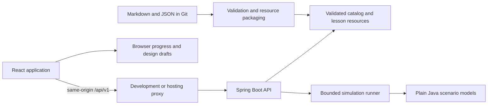

# Application architecture

Status: the foundation and request-flow slice implement the defaults below. Later capabilities remain proposed. Record consequential changes in an architecture decision.

## 1. Stack and boundaries

| Area | Default | Reason |
| --- | --- | --- |
| Frontend | React, TypeScript, Vite, React Router | Familiar repository family; typed UI contracts; browser application with separate Java API |
| Styling | CSS with semantic tokens and scoped component styles | Consistent themes, visible focus, controlled dependencies |
| Server data | Typed fetch client initially; add a cache library if repeated data flows justify it | Keep first slice small; centralize errors and cancellation |
| Static content | Markdown, structured JSON metadata/questions, build-rendered diagrams | Reviewable content and validation without a CMS |
| Topology | SVG for initial fixed topology; evaluate React Flow for later editing | Playback does not initially require a graph editor |
| Backend | Java 17 bytecode, Spring Boot 4, Maven Wrapper; CI on Java 21 | Works with the owner's local Java 17 and remains tested on the newer CI LTS |
| Execution | Plain Java domain modules and deterministic discrete-event engine | Testable without Spring or external infrastructure |
| Contracts | OpenAPI 3.1 for HTTP/events; JSON Schema 2020-12 for authored data | Shared validation and generated TypeScript types; see [decision 0002](decisions/0002-contracts-generate-frontend-types.md) |
| Tests | JUnit, Spring API tests; Vitest and React Testing Library; Playwright browser flows | Verify model semantics, integration, and actual learning journeys |
| Delivery | One frontend build and one backend image; optional Docker Compose | Simple local and hosted deployment |

React's documentation describes Vite-based setups and their routing/data-fetching responsibilities. Spring Boot 4 supports the selected Java 17 baseline. See [official sources](RESOURCES.md#implementation-references) and [decision 0001](decisions/0001-java-runtime-baseline.md). Dependencies are pinned in the Maven build and npm lockfile.

## 2. Runtime shape



The application is a modular monolith. The systems drawn inside a simulation are modeled entities, not separate deployed services. Reading content and simulation execution have separate frontend routes and code chunks.

### Repository layout

```text
frontend/
  src/app/                 routing, shell, theme, error boundaries
  src/features/learn/      catalog and topic reader
  src/features/experiment/ inputs, playback, inspector, metrics
  src/features/design/    guided case-study answers, later editor
  src/features/practice/  recall and later interview timer
  src/features/progress/  versioned local persistence
  src/components/         shared accessible controls and diagrams
  src/api/                generated types and API client
backend/
  pom.xml, mvnw, .mvn/
  src/main/java/com/hld/   catalog, content, simulation, estimation, api
  src/test/                model, contract, API, and fixture tests
content/
  catalog.json            canonical publication metadata
  topics/<id>/            lesson.md, questions.json, resources.json
  case-studies/<id>/      lesson.md, questions.json, resources.json
contracts/                OpenAPI and JSON Schemas
fixtures/                 inputs and expected semantic outcomes
scripts/                  content/contract checks and startup verification
docs/                     plans, decisions, templates, evidence
```

Create directories when needed. Backend model packages are organized by capability, not one enormous controller or service per topic. Models expose explicit interfaces; renderers are selected by a closed event/state vocabulary.

## 3. Catalog and content

`content/catalog.json` will be the single source for topic identity, prerequisites, order, level, publication state, and available capabilities. Frontend routes and backend lookup derive from it. Startup/build fails on duplicate IDs or invalid references.

Separate editorial status (`planned`, `draft`, `published`) from capabilities (`study`, `simulation`, `estimator`, `case-study`, `practice`). A published lesson may have no simulation; a declared simulation capability requires a registered, validated model. Public navigation shows published entries; planned entries can appear only as clearly labeled roadmap information.

Package validated lessons and metadata into the backend artifact during build; do not depend on the process working directory or fetch GitHub at runtime. The build must run from a clean checkout and Docker context with those resources included. Do not execute authored MDX or arbitrary HTML. Sanitize rendered content and SVGs; diagram generation must not permit script execution or uncontrolled file/network access.

## 4. Initial API contract

The topic and simulation endpoints and their OpenAPI schemas are implemented for `request-flow`; search, estimators, case studies, and stats remain planned for later phases.

| Endpoint | Purpose and behavior |
| --- | --- |
| `GET /api/v1/topics` | Published metadata with capabilities and prerequisite IDs |
| `GET /api/v1/topics/{id}` | Lesson, structured questions/resources, declared experiment or estimator references |
| `GET /api/v1/simulations/{id}` | Version, input schema, defaults, presets, limits, model assumptions |
| `POST /api/v1/simulations/{id}/runs` | Validate and execute one bounded simulation, returning a complete trace |
| `POST /api/v1/estimators/{id}/calculate` | Return unit-aware calculations, intermediate values, assumptions, and sensitivity range |
| `GET /api/v1/search?q=...` | Search published titles, body text, and glossary terms; bounded results |
| `GET /api/v1/case-studies/{id}` | Guided case-study document and rubric |
| `GET /api/v1/catalog/stats` | Generated counts by publication state and available capability |

Unknown IDs return 404. Invalid parameters return 400 with field paths and readable explanations. Oversized requests return 413; overload protection returns 429 or 503 with an explicit retry policy. Responses use one structured problem format including `code`, `message`, and `fieldErrors` when applicable. No stack traces in client errors.

Simulation input includes `schemaVersion`, `modelVersion`, `seed`, `parameters`, and a bounded `failureSchedule`. Results include versions, initial state, events, final state, metrics, assumptions, limits, completion status, and truncation reason. See [SIMULATION_SPEC.md](SIMULATION_SPEC.md).

Do not retain runs on the server initially. Playback and backwards seek are local operations over the returned trace. A run ID is for correlation, not a promise that a retrieval URL exists. Long-running jobs, cancellation, SSE, and run storage require a later decision if bounded synchronous execution becomes inadequate.

## 5. State and persistence

- Content belongs in Git; simulation state is request-local and discarded after response.
- Small preferences/progress use localStorage through a versioned adapter. Large experiment exports are downloaded, not silently stored without limits.
- Store topic IDs, activity states, bookmarks, local answers, and content versions. Avoid marking a topic mastered because the page was opened or scrolled.
- Export/import includes `schemaVersion`; validate size and shape, preview conflicts, and preserve existing completion by default. User-authored answer conflicts need an explicit choice.
- Handle denied/quota-exhausted storage gracefully with in-memory use and an export option.
- Shareable scenario links may encode small validated parameters; large traces use files. Never put free-text personal notes into a URL automatically.
- Accounts, PostgreSQL persistence, and cross-device sync remain deferred until a concrete requirement justifies migrations, authorization, and maintenance.

## 6. Resource and security boundaries

Only built-in model IDs execute. No user Java compilation, arbitrary URLs, remote request probes, or shell execution. Enforce request size, numeric bounds, node/request/event counts, concurrent-run limits, and response size on the server.

Initial defaults to validate in the first slice: 1,000 requests, 20 modeled nodes, 10,000 events, 2 MiB serialized trace, and 60 seconds virtual duration. Add a configurable wall-time deadline checked cooperatively by the runner. Tune using measurements and record changes; these are application safeguards, not learning claims.

Use same-origin API routing; configure allowed origins explicitly for any separate hosting. Log request IDs, model/version, duration, limit outcomes, and errors; avoid logging user notes or entire imported files. Hosted deployment must bound aggregate concurrent memory, not only each run.

## 7. Delivery and performance

The local workflow uses wrapper-backed Java startup, locked frontend dependencies, and a root launcher with cleanup, environment-overridable ports, and printed URLs. Defaults are frontend 5173 and backend 8080. An occupied port causes the corresponding service to fail and the launcher stops its sibling process.

First hosted workflow: build frontend assets and backend image, proxy `/api`, support deep-link refresh, configure health checks and resource limits. No provider or free-tier guarantee is assumed.

Read pages must not eagerly load topology editors or all simulation assets. Measure initial compressed JS, lesson render time, trace generation, and playback on a documented machine/browser before setting budgets. Virtualize long event logs, avoid rendering off-screen events, and show when displayed samples omit data. Metrics always use the defined full observation set.
