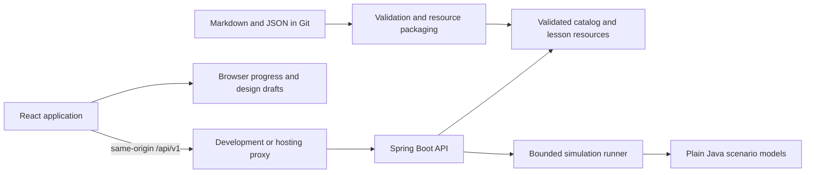

# Application architecture

Status: the foundation and four published modules (`request-flow`, `capacity-estimation`, `distributed-rate-limiter`, `cache-aside`) implement the defaults below except where a row or paragraph is marked **planned**. Record consequential changes in an architecture decision.

## 1. Stack and boundaries

| Area | Default | Reason |
| --- | --- | --- |
| Frontend | React, TypeScript, Vite, React Router | Familiar repository family; typed UI contracts; browser application with separate Java API |
| Styling | CSS with semantic tokens and scoped component styles | Consistent themes, visible focus, controlled dependencies |
| Server data | Typed fetch client initially; add a cache library if repeated data flows justify it | Keep first slice small; centralize errors and cancellation |
| Static content | Markdown, structured JSON metadata/questions, build-rendered diagrams | Reviewable content and validation without a CMS |
| Topology | SVG for initial fixed topology; evaluate React Flow for later editing | Playback does not initially require a graph editor |
| Backend | Java 17 bytecode, Spring Boot 4, Maven Wrapper; CI on Java 21 | Works with the owner's local Java 17 and remains tested on the newer CI LTS |
| Execution | Plain Java domain modules and deterministic discrete-event engine | Testable without Spring or external infrastructure |
| Contracts | OpenAPI 3.1 for HTTP/events; JSON Schema 2020-12 for authored data | Shared validation and generated TypeScript types; see [decision 0002](decisions/0002-contracts-generate-frontend-types.md) |
| Tests | JUnit, Spring API tests; Vitest and React Testing Library; Playwright browser journeys against the packaged backend and production build (`npm run e2e`; mocked-failure cases still planned) | Verify model semantics, integration, and actual learning journeys |
| Delivery | One frontend build and one backend image; optional Docker Compose | Simple local and hosted deployment |

React's documentation describes Vite-based setups and their routing/data-fetching responsibilities. Spring Boot 4 supports the selected Java 17 baseline. See [official sources](RESOURCES.md#implementation-references) and [decision 0001](decisions/0001-java-runtime-baseline.md). Dependencies are pinned in the Maven build and npm lockfile.

## 2. Runtime shape


```mermaid
flowchart LR
    Browser[React application] -->|same-origin /api/v1| Proxy[Development or hosting proxy]
    Proxy --> API[Spring Boot API]
    API --> Catalog[Validated catalog and lesson resources]
    API --> Runner[Bounded simulation runner]
    Runner --> Models[Plain Java scenario models]
    Browser --> Local[Browser progress and design drafts]
    Sources[Markdown and JSON in Git] --> Build[Validation and resource packaging]
    Build --> Catalog
```

The application is a modular monolith. The systems drawn inside a simulation are modeled entities, not separate deployed services. Reading content and simulation execution have separate frontend routes and code chunks.

### Repository layout

Current layout:

```text
frontend/
  e2e/                    Playwright browser journeys (`*.e2e.ts`)
  src/app/                routing and application shell
  src/pages/              lazy module/workshop routes, home, not-found
  src/components/         ModuleShell, async states, shared controls
  src/features/learning/  Study and Practice views shared by topics
  src/features/<module>/  request-flow, capacity-estimation, rate-limiter, cache-aside
  src/hooks/              small shared hooks such as page titles
  src/api/                generated OpenAPI types, type aliases, API client
  scripts/                content and contract validation
backend/
  pom.xml, mvnw, .mvn/
  src/main/java/com/hld/  api, catalog, simulation (+ engine), cache, ratelimit, estimation
  src/test/               model, engine, and API tests
content/
  catalog.json            canonical publication metadata
  topics/<id>/            lesson.md, questions.json, resources.json, checkpoints.json (guided)
  case-studies/<id>/      workshop.json, resources.json (draft URL-shortener ten-stage workshop)
contracts/                OpenAPI, JSON Schemas, API examples
scripts/                  planning-document validation
docs/                     plans, decisions, work items, templates, evidence
```

**Planned** additions, created only when their work item needs them: workshop publication (HLD-09C), progress features (HLD-10); shared Practice/Guided answer storage and import/reset controls are implemented in `features/learning/`. Semantic fixtures currently live in backend tests rather than a top-level `fixtures/` directory.

Backend model packages are organized by capability, not one enormous controller or service per topic. Each model has its own typed event schema with a closed `kind` vocabulary. A shared model interface and renderer registry are **planned** only if a concrete second consumer needs them (see [SIMULATION_SPEC.md](SIMULATION_SPEC.md#3-proposed-java-interface)).

## 3. Catalog and content

`content/catalog.json` is the single source for topic identity, prerequisites, order, level, publication state, and available capabilities. Frontend routes and backend lookup derive from it. Startup/build fails on duplicate IDs or invalid references.

Separate editorial status (`planned`, `draft`, `published`) from capabilities (`study`, `simulation`, `estimator`, `case-study`, `practice`). A published lesson may have no simulation; a declared simulation capability requires a registered, validated model. Public home navigation currently shows published topics. The draft workshop is available only by explicit case URL; it is excluded from topic endpoints. Planned entries can appear only as clearly labeled roadmap information.

Workshops use `workshopPath` and `GET /api/v1/case-studies/{id}` with `{entry, workshop}`. Java loads a matching canonical case path at startup. Typed stages and related-experiment links are checked against the content and API contracts; incomplete cases fail the publication guard. See [decision 0010](decisions/0010-draft-workshop-content-and-answers.md). Optional authored walkthroughs carry bounded participants and ordered steps in the same resource; Java validates endpoint references and React renders manual selection plus a full text equivalent, with no execution claims. See [decision 0012](decisions/0012-authored-workshop-walkthroughs.md).

Package validated lessons and metadata into the backend artifact during build; do not depend on the process working directory or fetch GitHub at runtime. The build must run from a clean checkout and Docker context with those resources included. Do not execute authored MDX or arbitrary HTML. Sanitize rendered content and SVGs; diagram generation must not permit script execution or uncontrolled file/network access.

## 4. Initial API contract

The topic endpoints serve all four published topics. Simulation endpoints are implemented for `request-flow`, `distributed-rate-limiter`, and `cache-aside`; estimator endpoints for `capacity-estimation`. Case-study delivery serves the draft URL-shortener resource (Requirements through Defense) by explicit ID; search and stats remain **planned**.

| Endpoint | Purpose and behavior |
| --- | --- |
| `GET /api/v1/topics` | Published metadata with capabilities and prerequisite IDs |
| `GET /api/v1/topics/{id}` | Lesson, structured questions/resources, declared experiment or estimator references |
| `GET /api/v1/simulations/{id}` | Version, input schema, defaults, presets, limits, model assumptions |
| `POST /api/v1/simulations/{id}/runs` | Validate and execute one bounded simulation, returning a complete trace |
| `GET /api/v1/estimators/{id}` | Read estimator defaults, presets, limits, and assumptions |
| `POST /api/v1/estimators/{id}/calculations` | Return unit-aware calculations, intermediate values, assumptions, and sensitivity range |
| `GET /api/v1/search?q=...` | Search published titles, body text, and glossary terms; bounded results |
| `GET /api/v1/case-studies/{id}` | Implemented: authored draft/published case metadata and versioned stages/rubrics; unknown/planned/topic IDs return 404 |
| `GET /api/v1/catalog/stats` | Generated counts by publication state and available capability |

Unknown IDs and unknown routes return 404. Invalid parameters return 400 with field paths and readable explanations. Oversized-request (413) and overload (429/503) responses are **planned**; today, bounded input sizes are enforced by validation and return 400. Responses use one structured problem format including `code`, `message`, and `fieldErrors` when applicable. No stack traces in client errors.

Simulation input is a flat, per-model object with `schemaVersion`, `modelVersion`, `seed`, and model-specific fields (for example `arrivalTimesMs`, or cache `operations`); `request-flow` v1.1.1 adds a bounded optional `failureSchedule`. Unknown fields are rejected. Results include versions, seed, status, events, per-request outcomes, metrics, and assumptions; limited runs add truncation reason, last virtual time, and incomplete counts. Cache-aside results also carry `initialState` and each event's post-event key state, which the playback renders ([decision 0006](decisions/0006-cache-event-key-state.md)); other models have no state snapshots. See [SIMULATION_SPEC.md](SIMULATION_SPEC.md) for accepted versions and envelope details.

Do not retain runs on the server initially. Playback and backwards seek are local operations over the returned trace. A run ID is for correlation, not a promise that a retrieval URL exists. Long-running jobs, cancellation, SSE, and run storage require a later decision if bounded synchronous execution becomes inadequate.

## 5. State and persistence

- Content belongs in Git; simulation state is request-local and discarded after response.
- **Module tabs (implemented).** `ModuleShell` mounts a tab's panel on its first visit and keeps it mounted but hidden afterwards, so draft inputs, submitted runs, results, playback position, and practice answers survive tab changes without re-fetching or re-running. Anything that runs on its own reads `usePanelActive()` and pauses while hidden; request-flow playback pauses and waits for the learner to resume. Selecting a tab adds a history entry, so Back and Forward move between views; the default view has no `?view=` parameter, and an unsupported value is replaced by the default without a history entry. Presets stay disabled while a run is pending, so an older response cannot replace a newly selected preset.
- **Refresh and leaving a module.** Shared Practice choices, explanations, and reference-view state are saved through a versioned local adapter (HLD-08A; [decision 0008](decisions/0008-local-practice-answers.md)). Old content-version answers stay visible and require a fresh comparison. Corrupt/unsupported data is preserved; storage failures keep new work in session memory with downloads and a clear warning. Guided predictions/tradeoff choices now persist with derived checkpoint activity IDs; traces still require an explicit Java run after reload. HLD-08B adds validated import/conflict preview, named module reset, and save retry ([decision 0009](decisions/0009-answer-import-and-guided-state.md)). Invalid/stale imports and failed writes preserve existing answers. Playground inputs/runs/playback and the selected Guided checkpoint remain transient.
- **Workshop navigation.** HLD-09B1 uses stable `?stage=` URLs for the ordered authored stages. Selecting a stage adds history; one stage is visible at a time. Stage selection is presentation state, not completion evidence. See [decision 0011](decisions/0011-workshop-stage-navigation.md).
- **Workshop answers.** HLD-09A reuses the existing answer envelope for `<stage>-attempt`, `<stage>-revision`, and `<stage>-check-<criterion>` records. Original and revised reasoning remain distinct; a viewed reference or self-check does not imply completion. Older versions require fresh review. Shared backups/import/reset/recovery apply without a schema migration.
- Small preferences/progress use localStorage through a versioned adapter. Large experiment exports are downloaded, not silently stored without limits.
- Store topic IDs, activity states, bookmarks, local answers, and content versions. Avoid marking a topic mastered because the page was opened or scrolled.
- Export/import includes `schemaVersion`; validate size and shape, preview conflicts, and preserve existing completion by default. User-authored answer conflicts need an explicit choice.
- Handle denied/quota-exhausted storage gracefully with in-memory use and an export option.
- Shareable scenario links may encode small validated parameters; large traces use files. Never put free-text personal notes into a URL automatically.
- Accounts, PostgreSQL persistence, and cross-device sync remain deferred until a concrete requirement justifies migrations, authorization, and maintenance.

## 6. Resource and security boundaries

Only built-in model IDs execute. No user Java compilation, arbitrary URLs, remote request probes, or shell execution. Enforce request size, numeric bounds, node/request/event counts, concurrent-run limits, and response size on the server.

Implemented defaults: `request-flow` accepts at most 100 requests and 8 nodes; the rate limiter at most 500 requests; the shared runner allows 10,000 events, an estimated 2 MiB trace, 60 seconds of virtual time, and a 10-second wall-clock deadline checked cooperatively. The wall-clock deadline is an execution guard, not modeled behavior, so a run it stops is censored and not promised to replay identically. Tune using measurements and record changes; these are application safeguards, not learning claims.

Use same-origin API routing; configure allowed origins explicitly for any separate hosting. Log request IDs, model/version, duration, limit outcomes, and errors; avoid logging user notes or entire imported files. Hosted deployment must bound aggregate concurrent memory, not only each run.

## 7. Delivery and performance

The local workflow uses wrapper-backed Java startup, locked frontend dependencies, and a root launcher with cleanup, environment-overridable ports, and printed URLs. Defaults are frontend 5173 and backend 8080. An occupied port causes the corresponding service to fail and the launcher stops its sibling process.

First hosted workflow: build frontend assets and backend image, proxy `/api`, support deep-link refresh, configure health checks and resource limits. No provider or free-tier guarantee is assumed.

Read pages must not eagerly load topology editors or all simulation assets. Measure initial compressed JS, lesson render time, trace generation, and playback on a documented machine/browser before setting budgets. Virtualize long event logs, avoid rendering off-screen events, and show when displayed samples omit data. Metrics always use the defined full observation set.
