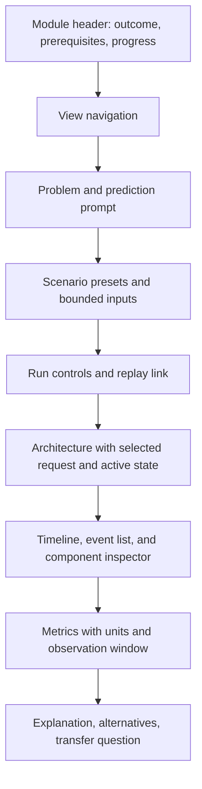

# UI, UX, and engineering quality standard

Status: design and review specification for implementation. This sets the quality bar; it is not a claim that the application exists. The owner selected [LLD with UI](https://github.com/Prem-Duvvapu/lld-with-ui) as the primary reference for a cohesive module page with operations, guided simulations, diagrams, and design explanations.

## 1. Experience direction

Make system behavior legible. A learner should see where a request is, why it waited, which component changed, and what design choice produced that result. The interface should feel like a calm engineering workbench: clear diagrams and numbers, restrained color, useful controls, and enough space to read reasoning.

The strongest pattern from LLD is a complete module in one place. For HLD, keep the shared module shell and add a request timeline, component inspector, workload controls, and evidence tied to the architecture. A generic animated network is insufficient; every visual action must represent an actual model event.

### Home and navigation

- The home page starts with “Continue learning” when there is saved progress; new visitors see the first learning path and a short explanation of how to use the site.
- Show curriculum by path and category. Each card identifies its outcome, prerequisites, duration as an editorial estimate if provided, and available capabilities. Do not show invented completion numbers.
- Search results identify whether a hit is a concept or case study and link to a real published route. Keep planned topics in a separately labeled roadmap view.
- Let learners return to the same module/view and input configuration via URL or saved progress. Personal free-text answers stay local and are never placed into a share URL without an explicit action.
- Breadcrumbs indicate category and module. Previous/next follows the chosen path while respecting prerequisites; preserve browser back/forward behavior.

### Shared module shell

Supported views, in a consistent order:

1. **Playground:** perform operations or configure a workload, run it, inspect exact outcomes.
2. **Guided Simulation:** follow a curated sequence with prediction checkpoints and explanation.
3. **Architecture:** study components, ownership, links, and bottlenecks.
4. **Request Sequence:** follow a write/read or failure path in causal order.
5. **Design Details:** assumptions, alternatives, costs, limitations, and production connections.
6. **Practice:** recall, diagnosis, and transfer questions with rubrics.

Every module also has an “Explain it” path: a one-sentence idea and small example before the experiment, then a teammate explanation and interview scaffold after it. Follow [the learning standard](LEARNING_STANDARD.md). Keep prompts close to the run and event evidence.

Show only implemented capabilities. For an estimator, label the first view “Calculator.” For a case study, use “Design Workshop” and relevant design views. A supported tab has a direct URL and a meaningful document title. If one view depends on a server request, changing tabs must preserve unsaved playground inputs and reveal an error or loading state in the destination view.

Architecture and Request Sequence may be different renderings of the same validated content/model data. Avoid duplicating labels and edges in manually maintained frontend tables. A topic author states which claims each diagram teaches; render diagrams where they clarify a mechanism.

### Page anatomy for an interactive topic

On wide screens, input controls, main visual, and inspector may share a row. On narrow screens, preserve this reading order in one column. Do not require horizontal page scrolling at 320 CSS pixels; oversized architecture canvases may scroll/pan within their own bounded region, with a text/list equivalent directly accessible.

## 2. Interaction rules

### Workload and run lifecycle

- Inputs are labeled with units, useful defaults, constraints, and immediate field feedback. Advanced controls stay collapsed until relevant. A preset states the scenario and the expected question, without revealing the result before the learner predicts it.
- A run captures an immutable snapshot of inputs, model version, seed, and failures. Editing a field marks the form changed; the current trace remains labeled with the inputs that produced it until the learner runs again.
- The primary action is visible and names what it will do: “Run workload,” “Calculate capacity,” or “Try this failure.” Disable it only when validation explains why.
- Reset playback returns to the initial event of the same run. “Restore preset” changes inputs and requires a new run. “Start over” in guided mode clears the guided state without deleting saved notes.
- Comparison uses two complete runs with a shared workload/seed and calls out every changed assumption. Show a table for comparable metrics and a synchronized timeline where it helps. Avoid misleading side-by-side comparisons of differently truncated runs.
- A share action includes only validated model parameters and version, within URL size limits. Export a trace as a file when sharing the full result is needed.

For design exercises and explanation prompts, invite an attempt before revealing a reference solution. After reveal, show the learner's own notes next to the reference and highlight which assumptions differ. Offer an explicit “Show reference” option without forcing an answer, and let the learner revise after comparison. This preserves LLD with UI's useful practice pattern while keeping the concept explanation accessible.

### Animation and evidence

- Play, pause, next, previous, seek, and speed have visible labels or accessible names. Speed changes playback only, never modeled timing.
- Highlight the active event, affected node/edge, selected request, and relevant metric at the same time. Keep highlighting in the browser viewport when practical without stealing focus.
- The event list remains readable with motion disabled; users can step through it entirely with buttons/keyboard. The graph's textual counterpart lists component states and active edges.
- Show statuses in text plus shape/icon/color. Reserve color consistently for normal flow, waiting, warning, failure, and selection across both themes.
- Put explanation beside the evidence: “Request 5 waited 200 ms because A's single worker processed requests 1 and 3 first.” Values come from the trace. The explanation must name the modeled rule and relevant assumption.
- When the trace is limited, show what stopped it, how many requests remain, and which metrics are incomplete. Never show a smooth completion animation for a partial trace.

### Failures and empty states

Different states need different messages: no run yet; invalid input; unknown module; model temporarily unavailable; server unreachable; model error; budget limit; no search results; no saved progress; unsupported imported version. Each state supplies an appropriate next action. A server error must not trigger a fabricated fallback trace.

## 3. Visual system

Create a small, documented token set before proliferating pages:

- Surfaces: page, card, inset, overlay, code; borders with subtle/default/strong values.
- Text: primary, secondary, muted, inverse; status colors designed for text contrast.
- Semantic states: neutral, active, waiting, success, warning, error; consistent in topology, timeline, table, and callouts.
- Typography: readable body line length and line height; tabular figures for numeric metrics; clear heading scale; monospace for IDs, formulas, events and logs only.
- Spacing and radius: a coherent small scale. Use layout grids and containers rather than one-off pixel positioning.
- Motion: short transitions that clarify change; no mandatory looping animation; reduced-motion setting removes continuous or large movement.

Use CSS variables through shared components. Avoid large blocks of inline styles and per-module `<style>` strings, which are difficult to theme and maintain. Diagrams use semantic labels and adequate contrast; at high zoom, text remains readable. Icons support labels rather than replacing them. Architectural edges indicate protocol or data direction where that matters.

Do not start with a generic dashboard of unrelated charts. The visual hierarchy follows the learning question: what changed, where, why, and how to decide differently.

## 4. Accessibility and responsive acceptance

The release target is WCAG 2.2 AA. Use the [W3C quick reference](https://www.w3.org/WAI/WCAG22/quickref/) and [tabs authoring pattern](https://www.w3.org/WAI/ARIA/apg/patterns/tabs/) when implementing the shared shell.

- Tabs are a true tab list with selected state and connected panels. Because some panels load asynchronously, use manual activation where focus alone would cause latency. Support arrow navigation, Enter/Space activation, and visible focus.
- Every input has a programmatic label, error association, and described unit. Numeric changes are possible through a text/number input even if a slider is offered.
- The simulation graph has a structured text/table alternative for every meaningful state. Pointer-only drag cannot be the sole route to inspect a node or seek an event.
- Announce run completion/error and selected event changes without flooding live regions for every animation frame. Pause controls retain focus.
- Verify the main flows at 320, 768, and 1440 CSS pixels, both themes, 200% zoom, keyboard-only navigation, and reduced-motion preference. Include at least one screen-reader walkthrough of a released simulation; automated checks alone are insufficient.
- Ensure diagrams, code blocks, long formulas, and metric tables have bounded overflow and retain readable labels on mobile.

## 5. Frontend code quality

- TypeScript strict mode, generated API types, explicit model/event discriminants, and exhaustive handling of result states. Avoid `any` at the API boundary.
- Route-level code splitting. Shared shell components are small and testable; model-specific rendering is selected through an explicit registry that fails visibly on an unsupported kind.
- One API client handles base URL, timeouts/abort, structured errors, and response validation where needed. Use request cancellation or stale-response guards when inputs or routes change.
- Keep server state, transient playback state, persisted progress, and unsaved form edits separate. Changes to one should not silently overwrite the others.
- Avoid effects that trigger duplicate runs or hidden polling. A user action produces one run; replay operates on the returned trace.
- Components express UI state with named variants and reusable controls. Keep calculation and simulation rules in Java; TypeScript may format and select data, not invent outcomes.
- Use stable keys/IDs and semantic HTML. Test browser history, route refresh, loading, empty, failure, and unsupported-version paths.
- Check a module's route, catalog entry, capabilities, architecture/sequence views, questions, and model registry together. Generated coverage catches missing pieces.

## 6. Backend code quality

- Separate HTTP DTOs and validation from pure domain models. Controllers resolve a registered model, validate input, invoke it, and map typed results/errors. They do not implement behavior.
- Make model inputs immutable after normalization. Scope scheduler, random streams, state, and budgets per request. Share only immutable descriptors and thread-safe registries.
- Use one explicit event type vocabulary, stable IDs, and versioned schemas. Avoid `Map<String,Object>` as the normal domain contract; use records/sealed types where they improve exhaustiveness.
- Policy variants must have distinct behavior and a fixture that shows the difference. Avoid generic Strategy/Factory scaffolding when a direct function suffices.
- Invariants are checked near mutations. Example: a request has one terminal outcome, a failed node cannot complete canceled work later, a cache entry cannot outlive its modeled expiry rule.
- Every failure path returns an intentional status/error. Input validation protects numeric overflow, invalid units, unbounded arrays, unknown enums, impossible schedules, and payload/trace size.
- Never rely on wall-clock time, sleep, external services, or process-wide mutable state for modeled outcomes. Real labs live behind separate profiles and have their own test rules.
- Use structured logging and correlation IDs for API operation; avoid trace payloads and user notes in logs. API docs and examples must match integration tests.
- Keep dependencies intentional, pin versions, and upgrade with tests. Static analysis/formatting should be stable in CI and documented, with no blanket warning suppressions.

## 7. Review gates and evidence

| Gate | What the reviewer checks |
| --- | --- |
| Learning | New learner can predict, run, explain, and apply the concept; content and model agree |
| UX | Main task is findable and understandable; real states, useful feedback, clear metric units, no dead controls |
| Visual | Consistent typography/tokens/spacing, balanced diagram density, legible both themes and at mobile sizes |
| Accessibility | Keyboard, focus, labels, reduced motion, diagram equivalent, a screen-reader walkthrough where required |
| Frontend | Strict types, state boundaries, route/API/error tests, manageable components, no fabricated results |
| Backend | Domain isolation, deterministic behavior, bounds, semantic fixtures, failure/concurrency isolation |
| Integration | Catalog/schema/route/capability agreement, fresh start and browser journey, honest docs |

Record screenshots of key states at desktop/mobile in both themes as review artifacts once the UI exists; do not treat a screenshot as proof that interactions work. A visual regression test may cover stable layouts, while manual review checks content meaning.

The first implementation slice establishes baseline bundle size, API response time for tiny/limit traces, and render performance on a documented machine. Set enforceable budgets from that evidence; avoid unmeasured arbitrary thresholds. Follow-up work that increases the measured cost must state the user benefit.

## 8. Contributor design review questions

Before shipping a module, answer:

1. Can a first-time user find its main operation without reading an implementation note?
2. Does changing a relevant input change an explainable result, including a failure path?
3. Can the learner tell what is measured, estimated, modeled, or assumed?
4. Is the same concept visible consistently in architecture, sequence, trace, metrics, and prose?
5. Can a keyboard user and a mobile user complete the learning loop?
6. Is every advertised capability actually available and covered by meaningful checks?
7. Does the module teach a real decision that transfers beyond its preset?

If any answer is uncertain, keep the module in review and document the gap. A polished picture without these properties is not a completed learning module.
